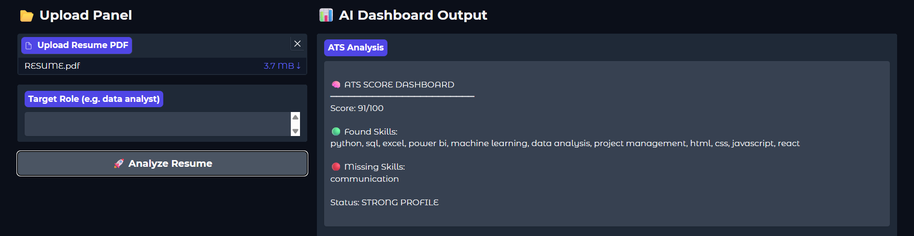
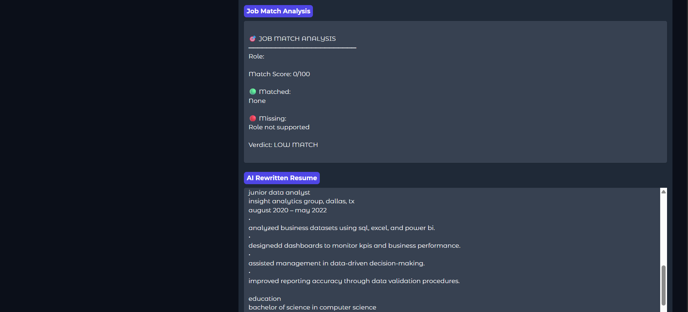

# 🧠 ResumeIQ — Resume Analysis & Career Intelligence Platform

**ResumeIQ** is a smart resume analysis tool that helps job seekers see their resume the way an Applicant Tracking System (ATS) and a recruiter would. Upload a PDF resume and instantly get an ATS compatibility score, job-role match analysis, detected skills, and actionable optimization suggestions — all through a clean, interactive **Gradio** dashboard.

Built for students and job seekers who want clear, data-backed feedback before sending their resume out, instead of guessing what's working and what isn't.


---

## 🚀 Features

- **📄 PDF Resume Parsing** — Extracts and structures text directly from uploaded PDF resumes.
- **📊 ATS Score Analysis** — Estimates how well a resume would pass through automated ATS filters.
- **🎯 Job Role Matching** — Compares resume content against target job roles to measure fit.
- **🧠 Skill Detection Engine** — Automatically identifies technical and soft skills mentioned in the resume.
- **✨ Resume Optimization** — Suggests concrete improvements to boost ATS score and role alignment.
- **🚀 Interactive Gradio Dashboard** — Upload, analyze, and review results in a single clean interface.

---

## 📸 Preview

### Dashboard


### ATS Analysis


### Resume Optimization


---

## 🛠️ Tech Stack

| Tool | Purpose |
|------|---------|
| [Gradio](https://www.gradio.app/) | Interactive web dashboard |
| [PyMuPDF (fitz)](https://pymupdf.readthedocs.io/) | PDF text extraction & parsing |
| Python 3.9+ | Core logic |

---

## ⚙️ Getting Started

### 1. Clone the repository
```bash
git clone https://github.com/AreefRasool/ResumeIQ.git
cd ResumeIQ
```

### 2. Install dependencies
```bash
pip install -r requirements.txt
```
Or directly:
```bash
pip install gradio pymupdf
```

### 3. Run the app
```bash
python app.py
```

The app will launch locally and also generate a shareable public link via Gradio's `share=True`.

> 💡 **Running in Google Colab / Kaggle?** Upload `app.py`, install dependencies with `!pip install gradio pymupdf`, then run the script — Gradio will give you a public shareable link.

---

## 🧠 How It Works

1. **Upload** a resume in PDF format
2. **Parse** the document and extract structured text
3. **Detect** skills, keywords, and resume sections
4. **Score** ATS compatibility and match against the selected job role
5. **Generate** optimization suggestions to improve the resume

---

## 🎯 Supported Roles

- Data Analyst
- Web Developer
- AI Engineer

> More roles can easily be added by extending the role-keyword matching logic.

---

## 📌 Future Improvements

- 🌐 Support for DOCX resume uploads
- 🤖 AI-generated resume rewriting suggestions
- 📈 Resume version comparison and improvement tracking
- 🧩 Expanded job-role library with custom role creation
- 🔗 LinkedIn profile cross-analysis

---

## 👤 Author

**Areef Rasool**
BSAI Student | AI, Development & Networking Enthusiast

---

## 📄 License

This project is open-source and available under the [MIT License](LICENSE).
